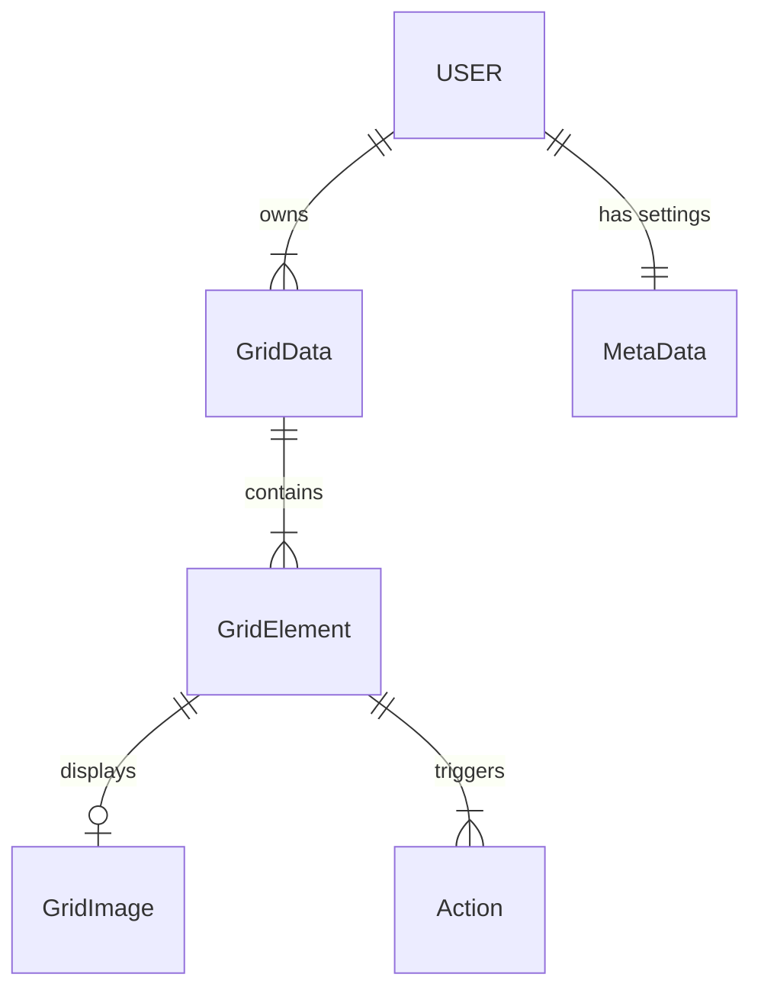

# AAC Database - Document Model

The application uses PouchDB (a browser-based NoSQL database) for local storage, with Firebase Cloud Firestore synchronization for cloud backup. Data is stored as JSON documents rather than in relational tables.

## Core Document Types

### GridData

Represents a complete communication grid (board). Each grid contains an array of grid elements arranged in a layout.

```
GridData {
  id: string                  // unique identifier
  modelName: "GridData"
  modelVersion: string        // schema version
  label: object | string      // grid name (locale map or plain string)
  rowCount: number            // number of rows in grid layout
  minColumnCount: number      // minimum columns in grid layout
  gridElements: GridElement[] // array of elements in the grid
  isGlobal: boolean           // whether this is the global/home grid
}
```

### GridElement

Represents a single tile/cell within a grid. Elements can be normal communication tiles, collect elements, prediction elements, or live data elements.

```
GridElement {
  id: string
  modelName: "GridElement"
  width: number               // tile width in grid units
  height: number              // tile height in grid units
  x: number                   // grid position x
  y: number                   // grid position y
  label: object | string      // display text (locale map or string)
  type: string                // ELEMENT_TYPE_NORMAL | ELEMENT_TYPE_COLLECT |
                              // ELEMENT_TYPE_PREDICTION | ELEMENT_TYPE_LIVE
  image: GridImage             // optional image for the tile
  actions: object[]           // array of actions triggered on selection
  backgroundColor: string     // tile background color
  borderColor: string         // tile border color
  fontColor: string           // text color
  hidden: boolean             // whether element is hidden
  colorCategory: string       // color coding category
}
```

### MetaData

Stores user-level settings and configuration.

```
MetaData {
  id: string
  modelName: "MetaData"
  inputConfig: object         // input method configuration
  colorConfig: object         // color scheme settings
  textConfig: object          // text display settings
  notificationConfig: object  // notification preferences
  locked: boolean             // whether UI is locked
}
```

### GridImage

Image data associated with a grid element.

```
GridImage {
  id: string
  data: string                // base64-encoded image data or URL
  author: string              // image attribution
  authorURL: string           // author link
}
```

### EncryptedObject

Wrapper for encrypted data stored in Cloud Firestore.

```
EncryptedObject {
  id: string
  modelName: "EncryptedObject"
  encryptedDataBase64: string  // AES-encrypted JSON payload
  modelVersionShort: string    // short version for metadata
}
```

## Document Relationships



## Storage Architecture

- **Local**: PouchDB stores documents in IndexedDB within the browser
- **Remote** (optional): Firebase Cloud Firestore instance for cross-device synchronization, caregiver/student profile metadata, and board assignments.
- **Encryption**: All remote data is AES-encrypted using SJCL before sync
- **Authentication**: Firebase Authentication (Google OAuth SSO) handles user registration and login.
- **Prediction Model**: Stored separately in localStorage as JSON (~50KB)
