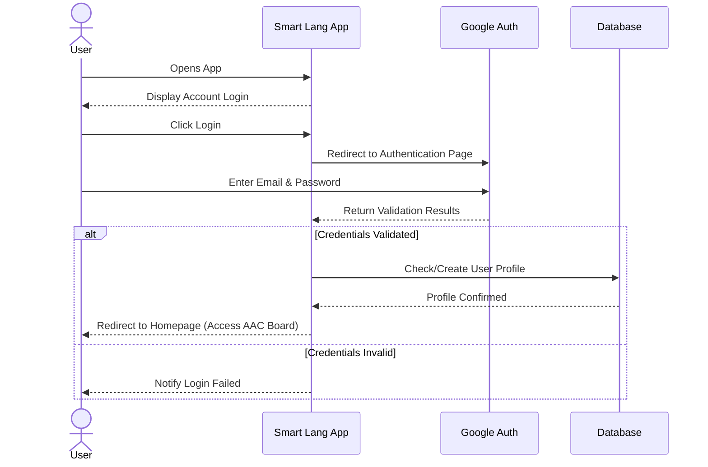
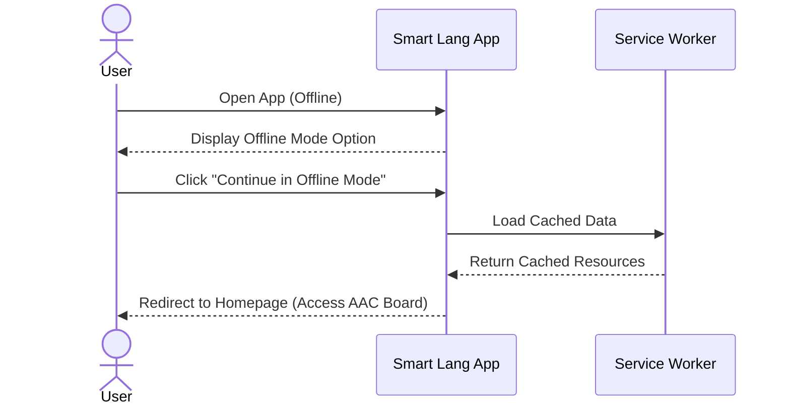
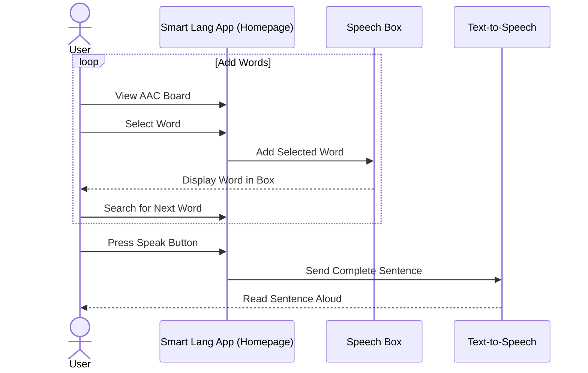
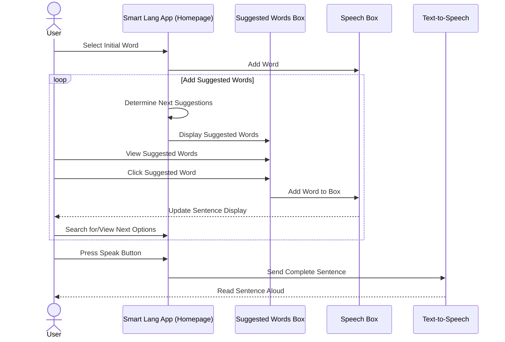
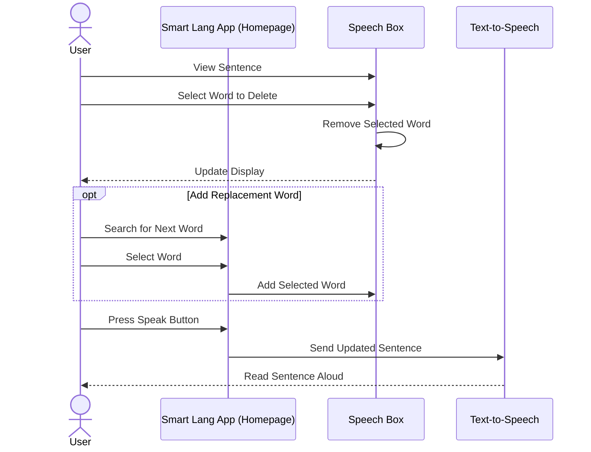
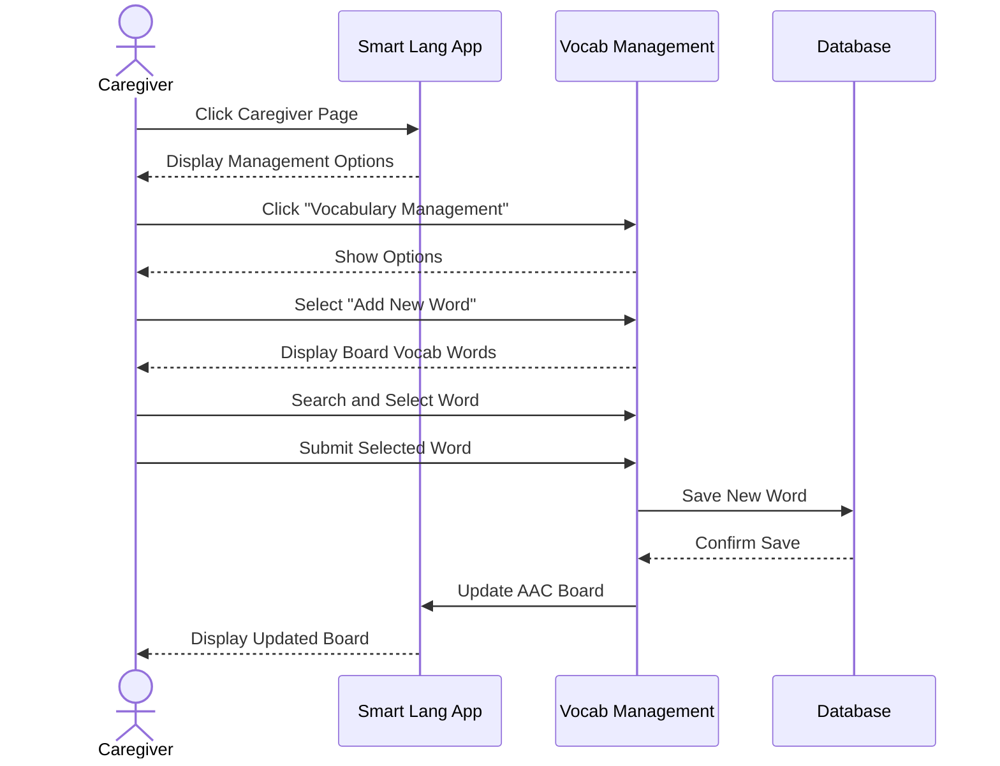
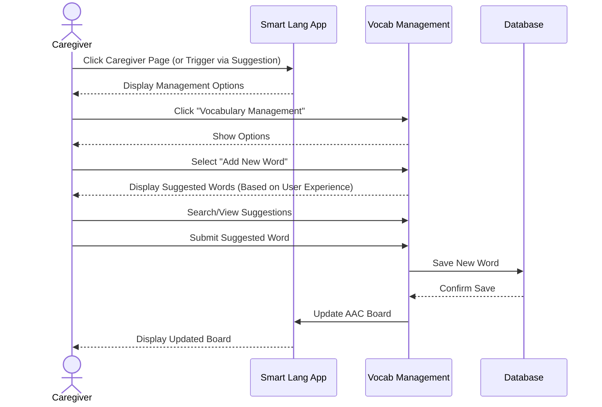
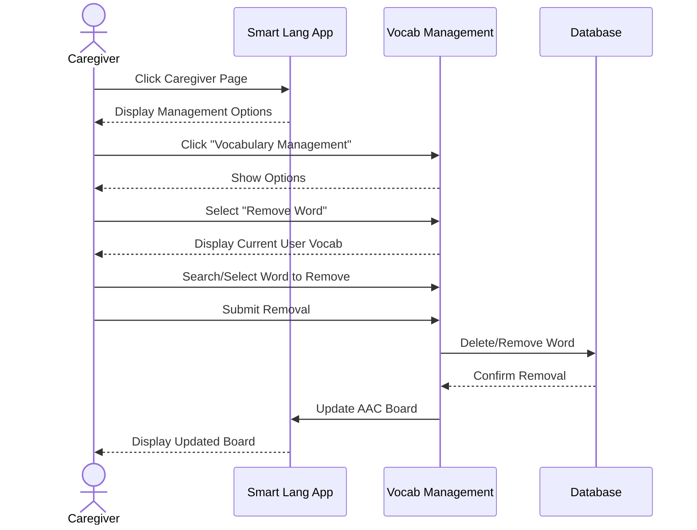

### Use Case 1: Account Login

1. The user opens the Smart Lang app, and account login is displayed on the landing page.
2. The user clicks on the login button.
3. The system redirects the user to Google’s authentication page.
4. The user enters their Google email and password.
5. The system creates a user profile in the database if the user is new.
6. If the credentials are validated and authenticated, then the user is directed to the homepage and can access the ACC board. If not, the user is notified that the credentials are invalid and login failed. 

### Use Case 2: Offline Accessibility

### Use Case 3: Sentence Creation (Without Suggestion)

### Use Case 4: Sentence Creation (With Suggestion)

### Use Case 5: Sentence Editing

### Use Case 6: Caregiver Adds Vocabulary (Without Suggestion)

### Use Case 7: Caregiver Adds Vocabulary (With Suggestion)

### Use Case 8: Caregiver Removes Vocabulary

