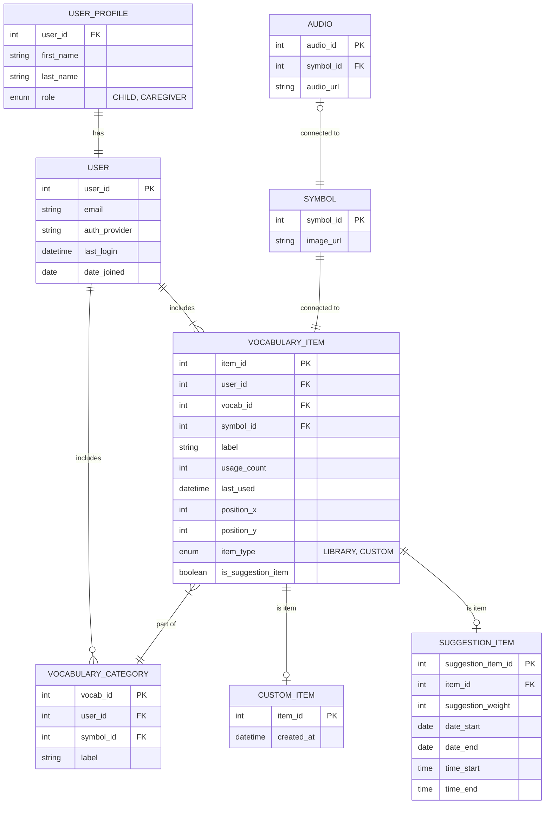

# AAC Database Entity-Relation Diagram

```mermaid
erDiagram
    USER {
        int user_id PK
        string email
        string auth_provider
        datetime last_login
        date date_joined
    }

    USER_PROFILE {
        int user_id FK
        string first_name
        string last_name
        enum role  "CHILD, CAREGIVER"
    }

    VOCABULARY_CATEGORY {
        int vocab_id PK
        int user_id FK
        int symbol_id FK
        string label
    }

    VOCABULARY_ITEM {
        int item_id PK
        int user_id FK
        int vocab_id FK
        int symbol_id FK
        string label
        int usage_count
        datetime last_used
        int position_x
        int position_y
        enum item_type  "LIBRARY, CUSTOM"  
        boolean is_suggestion_item
    }

    CUSTOM_ITEM {
        int item_id PK
        datetime created_at
    }

    SUGGESTION_ITEM {
        int suggestion_item_id PK
        int item_id FK
        int suggestion_weight
        date date_start
        date date_end
        time time_start
        time time_end
    }

    SYMBOL {
        int symbol_id PK
        string image_url
    }

    AUDIO {
        int audio_id PK
        int symbol_id FK
        string audio_url
    }

    USER ||--|{ VOCABULARY_ITEM : "includes"
    USER ||--o{ VOCABULARY_CATEGORY : "includes"
    VOCABULARY_ITEM }|--|| VOCABULARY_CATEGORY : "part of"
    VOCABULARY_ITEM ||--o| CUSTOM_ITEM : "is item"
    VOCABULARY_ITEM ||--o| SUGGESTION_ITEM : "is item"
    SYMBOL ||--|| VOCABULARY_ITEM : "connected to"
    AUDIO |o--|| SYMBOL : "connected to"
    USER_PROFILE ||--|| USER : "has"
```
